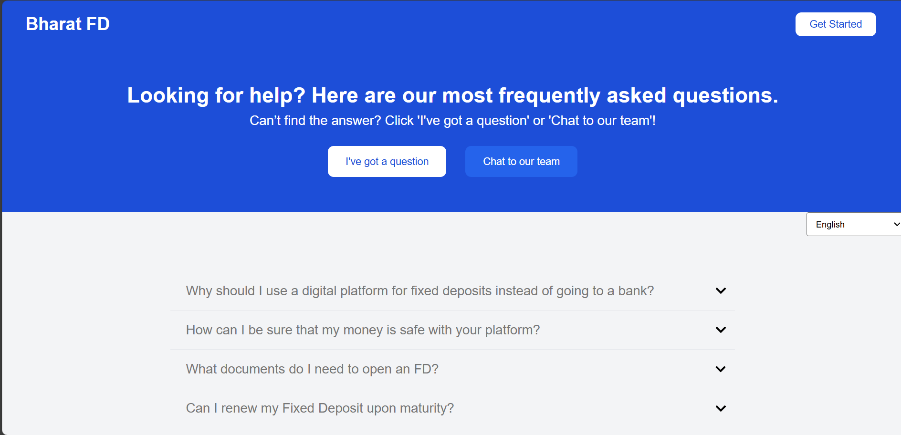
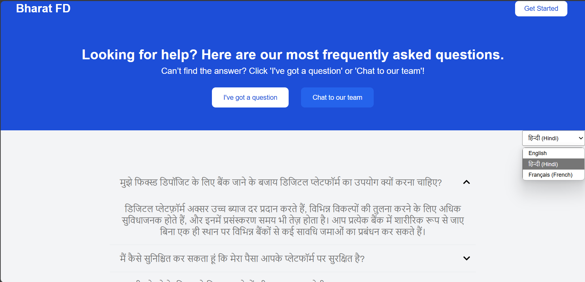
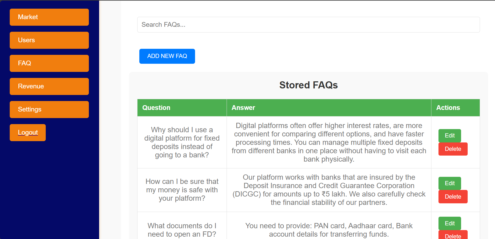
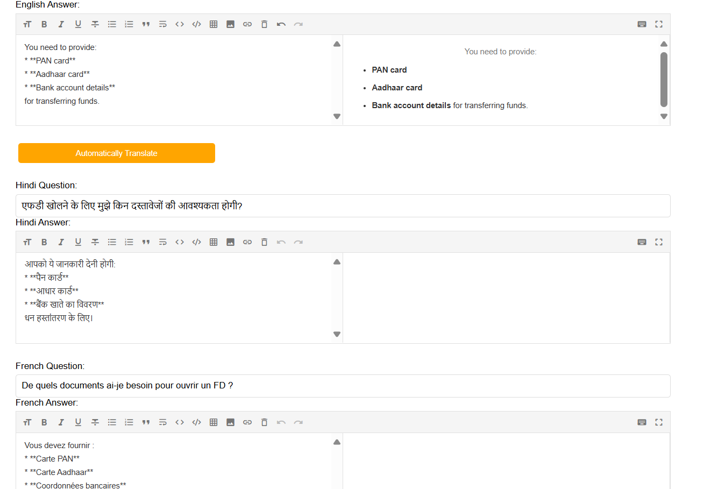

# FAQ Page Project

A simple and dynamic FAQ page that provides multilingual support with automatic translations and caching using Redis for faster response times. The FAQ page allows users to get answers to frequently asked questions in multiple languages (Hindi, French, etc.).

## Features

- **Multilingual Support**: Translates FAQs from English to other languages like Hindi and French.
- **Redis Caching**: Utilizes Redis to cache translations for faster subsequent fetches.
- **Real-time API**: Interacts with Google Translate API to fetch translations in real-time.
- **Dynamic Content**: Frequently asked questions are fetched from a MongoDB database.
- **Error Handling**: Displays error messages in case of failed API calls or server issues.

{: width="400" height="300"}
{: width="400" height="300"}
{: width="400" height="300"}
{: width="400" height="300"}

## Tech Stack

- **Frontend**: React.js
- **Backend**: Node.js, Express.js
- **Database**: MongoDB
- **Cache**: Redis (Upstash Redis for cloud storage)
- **API**: Google Translate API

## Usage

### Fetch FAQ
On the homepage, the user can view a list of frequently asked questions. These questions and answers will be dynamically fetched from the MongoDB database.

### Translation
The user can get answers in multiple languages (currently Hindi and French) based on the translations provided via the Google Translate API.

## Redis Caching

Redis is used to cache the translations for quicker response times on repeated requests. The cache is set with an expiration time of 24 hours.

- On the first request for a specific translation, the app calls the Google Translate API and stores the result in Redis.
- On subsequent requests, the app fetches the cached translation from Redis.

## Environment Variables

- **GOOGLE_TRANSLATE_API_KEY**: Your API key for Google Translate.
- **REDIS_URL**: The URL for your Redis instance.
- **REDIS_PASSWORD**: The password for your Redis instance.
